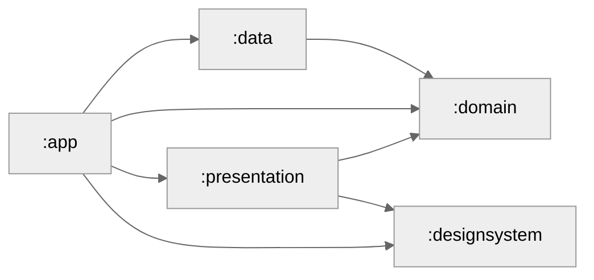
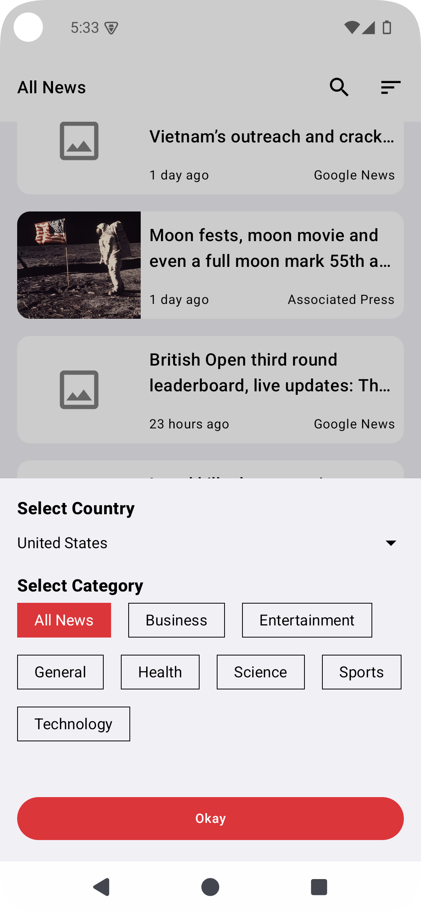
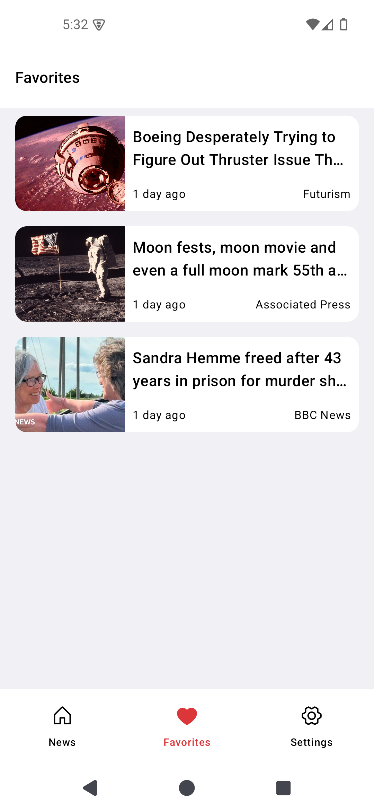
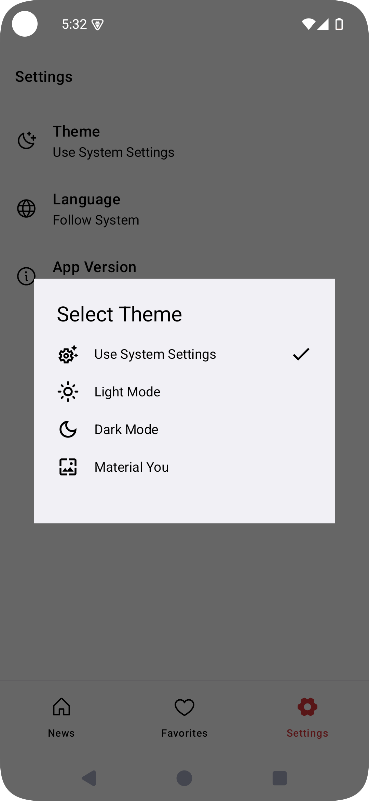
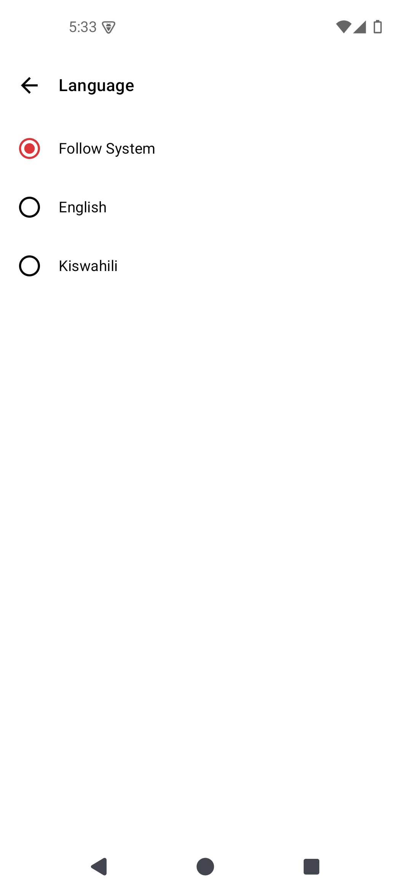

### NewsApp
This is a simple news app that fetches news from the [News API](https://newsapi.org/). It is built with Jetpack Compose

## Setup Requirements
Obtain your key from [News API](https://newsapi.org/) and replace it in the `local.properties` file:

```gradle
    API_KEY=API_KEY_VALUE
```

### Features
- Display news in a list
- Display news details
- Theming
- Language selection
- Search news
- Share news
- Bookmark news

## Technical Decisions

### Project Purpose

I created this project for fun and to learn about writing tests. I believe in the principle that "There is no best architecture. There is only architecture that’s best for your application and your needs." With this in mind, I chose to use clean architecture, dividing the project into three layers. Although this approach does not scale well, it suits this app because it only has one feature, so there was no need to complicate it.

### Architecture Decisions

#### Layer-Based Approach

I opted for a layer-based architecture over a feature-based approach because:

- The app is small and has only one feature, and I don’t foresee it growing significantly in the future. Thus, a feature-based approach would add unnecessary complexity.
- Features are tightly interrelated and share a lot of common logic.

#### Module Usage

You might wonder why I chose to use modules instead of putting all code into a single module (`:app`). The reason is simple: I wanted a clear separation of concerns.

#### Dependency Injection

For dependency injection, all modules are bound in the top-level app module. This approach aligns with the principle that neither the Domain Module nor the Data Module should be aware of a dependency injection container. DI containers should be configured near the composition root of your application (e.g., the main method or an "application" class). Dependencies that need to be passed to domain or repository classes should be done through constructor injection, eliminating references to DI classes in those modules.

### Cons

- As the project grows, it can become harder to navigate due to the mix of multiple feature-related classes within the same module.
- It can lead to tightly coupled code if not managed properly.
- Adding a new feature involves touching multiple modules.


### Project Structure

#### Data Layer (Android Module)

The data layer holds the application data, including both local and remote data sources. It depends on the domain layer to implement domain contracts. I wrote tests for the PagingSource and the DAO in this layer.

#### Domain Layer (Pure Kotlin Module)

The domain layer contains the business logic, including repositories, models, and use cases. I wrote tests for the use cases in this layer.

#### Presentation Layer

The presentation layer contains the screens and their viewmodels. I followed the MVVM pattern (unidirectional) here. I chose to use separate data models for the presentation layer rather than the domain models. This decision was made because navigation from the list screen to the details screen required making the data class Parcelable. Additionally, I wanted to avoid having the domain module dictate decisions for the presentation layer.

### Module Graph



Here's a breakdown of the module dependencies:
- `app` depends on `data`, `domain`, `presentation`, and `designsystem`.
- `presentation` depends on `domain` and `designsystem`.
- `data` depends on `domain`.

### Testing
- I wrote tests for the `PagingSource` and `DAO` in the data layer.
- I wrote tests for the `usecases` in the domain layer.
- I wrote tests for the `viewmodels` in the presentation layer.
- I wrote tests for the UI in the presentation layer.
- I wrote some tests for navigation.

### Libraries
- [Jetpack Compose](https://developer.android.com/jetpack/compose) - Modern toolkit for building native UI
- [Retrofit](https://square.github.io/retrofit/) - A type-safe HTTP client for Android and Java
- [Room](https://developer.android.com/jetpack/androidx/releases/room) - The Room persistence library provides an abstraction layer over SQLite
- [Hilt](https://developer.android.com/training/dependency-injection/hilt-android) - Dependency injection library for Android that reduces the boilerplate of doing manual dependency injection in your project
- [Coil](https://coil-kt.github.io/coil/) - An image loading library for Android backed by Kotlin Coroutines
- [Type Safe Navigation](https://developer.android.com/guide/navigation/design/type-safety) - Type safety in Kotlin DSL and Navigation Compose
- [Coroutines](https://developer.android.com/kotlin/coroutines) - For managing background threads with simplified code and reducing needs for callbacks
- [Flow](https://kotlinlang.org/docs/flow.html) - A cold asynchronous data stream that sequentially emits values and completes normally or with an exception
- [Paging 3](https://developer.android.com/topic/libraries/architecture/paging/v3-overview) - The Paging library helps you load and display pages of data from a larger dataset from local storage or over network
- [Kotlinx Serialization](https://github.com/Kotlin/kotlinx.serialization) - Kotlin multiplatform / multi-format serialization
- [Truth](https://truth.dev/) - Fluent assertions for Java and Android
- [Turbine](https://github.com/cashapp/turbine) - A small testing library for kotlinx.coroutines Flow

### Plugins
- [Spotless](https://github.com/diffplug/spotless) - Keep your code spotless
- [Detekt](https://github.com/detekt/detekt) - A static code analysis tool for the Kotlin programming language
- [Ktlint Gradle](https://github.com/JLLeitschuh/ktlint-gradle) - A gradle plugin for linting and formatting Kotlin code
- [Modulegraph](https://github.com/iurysza/module-graph) - A Gradle Plugin for visualizing your project's structure, powered by mermaidjs

### Screenshots
       


### License
```
Copyright (C) 2024 Joel Kanyi
   Licensed under the Apache License, Version 2.0 (the "License");
   you may not use this file except in compliance with the License.
   You may obtain a copy of the License at

       http://www.apache.org/licenses/LICENSE-2.0

   Unless required by applicable law or agreed to in writing, software
   distributed under the License is distributed on an "AS IS" BASIS,
   WITHOUT WARRANTIES OR CONDITIONS OF ANY KIND, either express or implied.
   See the License for the specific language governing permissions and
   limitations under the License.
```